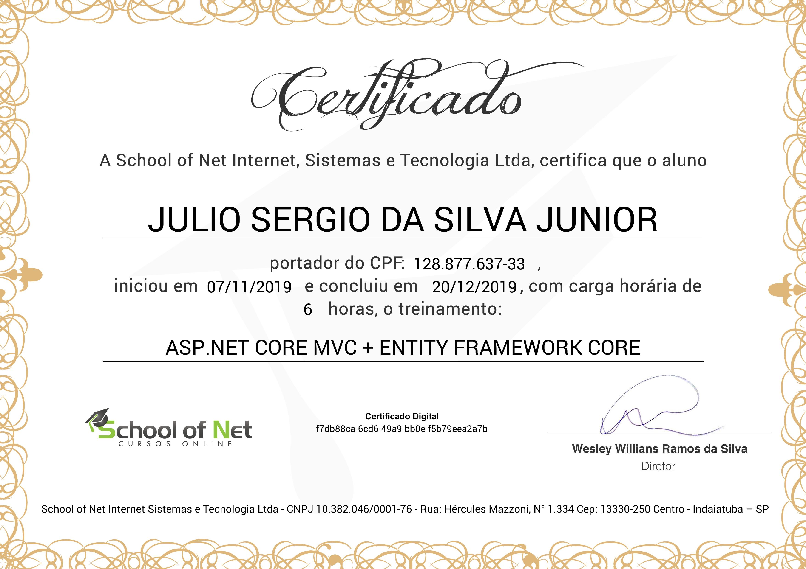

# ASP.NET Core MVC + Entity Framework Core
## [School of Net](https://www.schoolofnet.com)

* ASP.NET Core
* MVC
* Entity Framework Core

Instrutor: Anybal Rocha

"Neste curso será apresentado ao aluno como trabalhar com o Entity Framework Core nas aplicações ASP.NET Core. Através dos CRUDs, utilização de Migrations, herança, Injeção de Dependência, trabalhando com tipos complexos de dados, dentre outras possibilidades que podem ser resolvidas com ASP.NET Core MVC e EF Core, versão que foi reescrita para atender a necessidade de ser multiplataforma."

